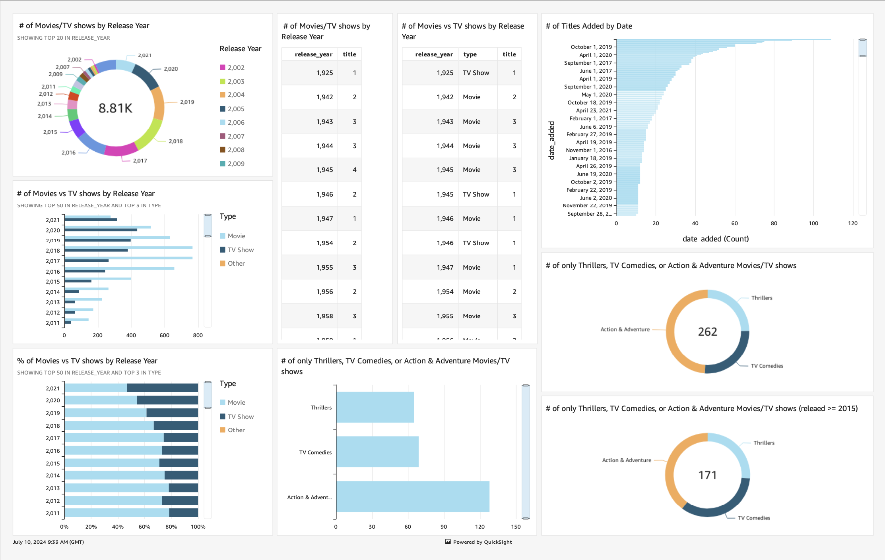

# AWS QuickSight Dashboard for Netflix TV Shows and Movies

## What is QuickSight?

AWS QuickSight is a cloud-powered business intelligence (BI) service that makes it easy to deliver insights to everyone in your organization. As a scalable, serverless, embeddable, machine learning-powered BI service built for the cloud, QuickSight lets you create and publish interactive dashboards that include Machine Learning (ML) Insights. These dashboards can then be accessed from any device and embedded into your applications, portals, and websites.

Today, I used QuickSight to create a comprehensive dashboard using a dataset of Netflix TV shows and movies. The experience was highly intuitive, with a user-friendly interface that simplified the process of data visualization and dashboard creation.

## My Key Learnings

1. **Data Preparation and Import:** QuickSight provides robust options for data preparation, including direct connections to various data sources and the ability to perform ETL operations.
2. **Visualization Tools:** The platform offers a wide range of visualization options, including charts, graphs, and tables, which can be customized to suit the data analysis requirements.
3. **Interactivity and Filters:** Adding interactivity through filters and controls enhances the user experience, making it easier to drill down into specific data points.
4. **Collaboration and Sharing:** Dashboards can be easily shared with team members, promoting collaborative decision-making and data-driven strategies.

## Final Thoughts

Working with AWS QuickSight has been an insightful journey. It is an excellent tool for creating dynamic and interactive dashboards, making data analysis more accessible and actionable. The ability to integrate machine learning insights adds a significant value, enabling predictive analytics and more informed decision-making.

Overall, QuickSight proves to be a powerful BI tool that combines ease of use with advanced analytical capabilities. Whether for a small business or a large enterprise, QuickSight can cater to various data visualization needs effectively. I look forward to exploring more advanced features and leveraging QuickSight for future data analysis projects.
